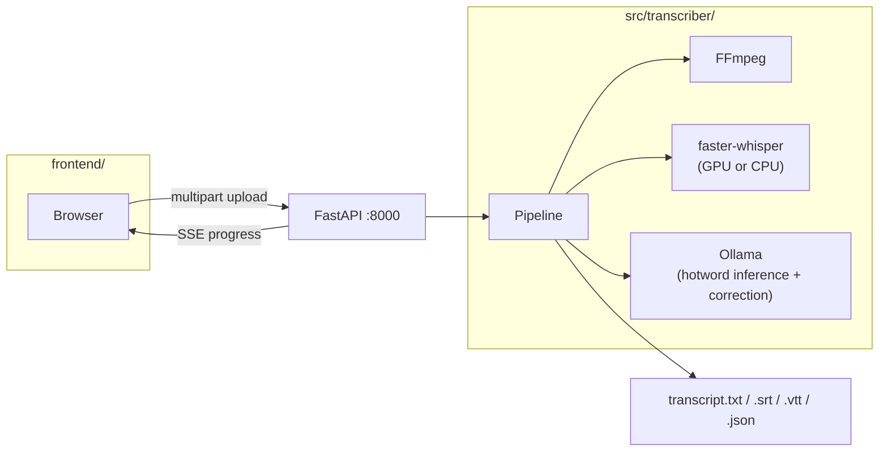

# local-transcriber

GPU-accelerated local audio transcription using [faster-whisper](https://github.com/SYSTRAN/faster-whisper) with Silero VAD, automatic two-pass hotword inference, and an optional LLM correction pass via [Ollama](https://ollama.com). Runs entirely on your machine — no audio or text leaves it.

## Features

- **Adaptive GPU/CPU** — auto-detects CUDA compute capability; falls back to CPU int8 transparently, including Blackwell (sm_120+)
- **Two-pass ASR** — pass 1 transcribes, Ollama infers context + hotwords, pass 2 re-transcribes with those as hints
- **Guardrail-protected corrections** — numbers, negations, and large rewrites are always rejected
- **Seven output formats** — clean text, raw ASR, timestamped, SRT, VTT, JSON, review report
- **Web UI** — drag-and-drop upload, live progress via SSE, tabbed transcript view with copy + download
- **CLI** — full-featured command-line interface for scripting and batch use

## Prerequisites

| Tool | Minimum | Install |
|------|---------|---------|
| [uv](https://docs.astral.sh/uv/) | any | `curl -LsSf https://astral.sh/uv/install.sh \| sh` |
| [FFmpeg](https://ffmpeg.org) | any | `sudo apt install ffmpeg` |
| [Node.js](https://nodejs.org) | 18+ | system package manager or [nvm](https://github.com/nvm-sh/nvm) |
| [Ollama](https://ollama.com) | any | optional; needed for LLM correction |
| NVIDIA GPU + driver ≥ 525 | — | optional; CPU fallback is automatic |

## Quick start

### Option A — one command (recommended)

```bash
git clone https://github.com/YOUR_USERNAME/local-transcriber
cd local-transcriber
./start.sh
# → API:      http://localhost:8000
# → Web app:  http://localhost:3000
```

The script installs all dependencies on first run, starts the FastAPI server in the background, then launches the Next.js dev server in the foreground. Press **Ctrl+C** to stop everything.

**Options:**

```bash
./start.sh --port-api 8080 --port-ui 4000   # custom ports
./start.sh --no-ollama                        # suppress missing-Ollama warning
```

### Option B — manual (two terminals)

**Terminal 1 — API server:**

```bash
uv sync
uv run transcribe-server          # listens on http://localhost:8000
```

**Terminal 2 — frontend:**

```bash
cd frontend
npm install
cp .env.local.example .env.local  # if it doesn't exist; default is localhost:8000
npm run dev                        # http://localhost:3000
```

## CLI usage

```bash
# Transcribe a file (auto-detects GPU, runs full two-pass pipeline)
uv run transcribe audio.mp4

# Faster: skip the second pass and Ollama correction
uv run transcribe podcast.mp3 --model large-v3-turbo --no-ollama --single-pass

# Specify language and context
uv run transcribe lecture.wav --language en --context "machine learning tutorial"

# All options
uv run transcribe --help
```

Output lands in `<filename>_transcript/`:

| File | Contents |
|------|----------|
| `transcript.txt` | Clean corrected text |
| `transcript_raw.txt` | Original Whisper output — never modified |
| `transcript_timestamped.txt` | Corrected text with timestamps |
| `transcript.srt` | SRT subtitles |
| `transcript.vtt` | WebVTT subtitles |
| `transcript.json` | Full metadata + per-segment data |
| `review_needed.txt` | Low-confidence regions for human review |

## Architecture



## Configuration

Copy `.env.example` to `.env` in the project root and adjust as needed:

```bash
TRANSCRIBER_HOST=0.0.0.0   # API bind address
TRANSCRIBER_PORT=8000       # API port
```

The frontend reads `NEXT_PUBLIC_API_URL` from `frontend/.env.local` (created automatically by `start.sh`). Edit it to point at a different host if needed.

## API reference

### `POST /api/jobs`

Upload an audio/video file to start a transcription job.

```bash
curl -X POST http://localhost:8000/api/jobs \
  -F "file=@audio.mp3" \
  -F "model=large-v3" \
  -F "language=auto" \
  -F "no_ollama=false"
# → { "job_id": "uuid" }
```

Key form fields (all optional except `file`):

| Field | Default | Notes |
|-------|---------|-------|
| `model` | `large-v3` | Any faster-whisper model name |
| `language` | `auto` | ISO code or `auto` |
| `single_pass` | `false` | Skip hotword inference + pass 2 |
| `vad_threshold` | `0.45` | Silero VAD threshold (0–1) |
| `no_ollama` | `false` | Skip LLM correction |
| `ollama_model` | `qwen3:30b-a3b` | Any locally available Ollama model |
| `context` | `""` | Domain/speaker hint |
| `hotwords` | `""` | Comma-separated vocabulary hints |

### `GET /api/jobs/{job_id}`

Server-Sent Events stream. Each event carries a JSON object with a `type` field:

| `type` | Description |
|--------|-------------|
| `status` | Initial state (`queued` / `running`) |
| `progress` | Human-readable progress line |
| `result` | Final transcript data when complete |
| `error` | Error detail if the job failed |

### `GET /api/health`

```json
{ "status": "ok", "gpu": { "compute_cap": 12.0, "cuda_major": 13 }, "device": "cuda", "compute_type": "float16" }
```

## Development

```bash
# Run the full check suite
uv run ruff check src/ tests/
uv run ruff format --check src/ tests/
uv run mypy src/
uv run pytest --cov=src/transcriber

# Frontend build check
cd frontend && npm run build
```

Pre-commit hooks (optional):

```bash
uv run pre-commit install
```

## License

MIT — see [LICENSE](LICENSE).
