# local-transcriber

GPU-accelerated local audio transcription using [faster-whisper](https://github.com/SYSTRAN/faster-whisper) with a two-pass pipeline, automatic domain vocabulary inference, and LLM-driven error correction. Everything runs on your own machine — no audio or text is ever sent to a cloud service.

[](https://github.com/YOUR_USERNAME/local-transcriber/actions/workflows/ci.yml)

---

## Table of contents

- [Why it exists](#why-it-exists)
- [How it works](#how-it-works)
  - [Stage 1 — FFmpeg decode](#stage-1--ffmpeg-decode)
  - [Stage 2 — Pass 1 ASR](#stage-2--pass-1-asr)
  - [Stage 3 — Hotword inference](#stage-3--hotword-inference)
  - [Stage 4 — Pass 2 ASR](#stage-4--pass-2-asr)
  - [Stage 5 — Ollama correction](#stage-5--ollama-correction)
  - [Guardrails](#guardrails)
  - [Quality scoring and review report](#quality-scoring-and-review-report)
  - [GPU detection and fallback](#gpu-detection-and-fallback)
  - [Real-time progress (SSE)](#real-time-progress-sse)
- [Features](#features)
- [Prerequisites](#prerequisites)
- [Quick start](#quick-start)
- [CLI usage](#cli-usage)
- [Output files](#output-files)
- [Architecture overview](#architecture-overview)
- [Source layout](#source-layout)
- [API reference](#api-reference)
- [Configuration](#configuration)
- [Development](#development)
- [Troubleshooting](#troubleshooting)
- [License](#license)

---

## Why it exists

Transcription services that send audio to a third-party API work well when:
- Your audio is non-sensitive.
- Your vocabulary is general English.
- You accept billable-per-minute pricing.

This project targets the opposite case: technical or confidential recordings where the vocabulary is domain-specific (ML paper titles, product names, CLI commands) and sending audio offsite is not acceptable. Running [Whisper](https://openai.com/research/whisper) locally with an RTX 4090 or 5090 is faster than real-time and costs nothing per run.

---

## How it works

The pipeline has five stages. Understanding each one helps you tune it for your content.

### Stage 1 — FFmpeg decode

Every audio and video format that FFmpeg can read (MP3, MP4, MKV, FLAC, Opus, WebM, …) is normalised to a **16 kHz mono PCM WAV** before it reaches Whisper. This is the sample rate Whisper expects; feeding it anything else would require Whisper to resample internally, which is slower and less precise.

Optional loudness normalisation (`--normalise-audio`) uses the EBU R 128 standard (`loudnorm=I=-16:TP=-1.5:LRA=11`). This is useful for recordings with inconsistent levels (e.g., a mix of in-person and phone audio).

### Stage 2 — Pass 1 ASR

Whisper transcribes the decoded audio with **no domain knowledge supplied** — no context, no vocabulary hints. This "cold" first pass gives a rough but complete transcript.

Before each audio segment reaches Whisper, [Silero VAD](https://github.com/snakers4/silero-vad) filters out silence. Without VAD, Whisper would hallucinate plausible-sounding text on silent regions — a well-known failure mode. With VAD, only frames above the threshold (`--vad-threshold`, default 0.45) are sent to the ASR model.

Each resulting segment receives:
- A **quality score** computed from three signals (see [Quality scoring](#quality-scoring-and-review-report)).
- A list of **review reasons** flagging possible problems (low log-probability, high repetition ratio, etc.).

### Stage 3 — Hotword inference

The pass-1 transcript is mined for vocabulary that should be supplied to Whisper as **hotwords** and an **initial prompt** in pass 2.

Two methods run in sequence:

1. **Regex heuristics** (always active) — three patterns scan the raw text:
   - Acronyms (`[A-Z]{2,}`)
   - CamelCase tokens (`[A-Z][a-z]+[A-Z]`)
   - Technical tokens (version strings, file extensions, CLI flags)

   A term must appear **at least twice** to be included, which filters out random capitalised words. Any word Whisper was unsure about (per-word probability < 0.6) and capitalised is also flagged as a potential proper noun.

2. **Ollama inference** (optional, enabled by default) — the first ~4 000 characters of the pass-1 transcript are sent to a locally running LLM. The prompt asks for:
   - A one-or-two sentence `context_summary` describing the recording's subject.
   - A `glossary` of proper nouns, acronyms, and domain vocabulary.

   The model is called with `keep_alive: "0"` so its weights are unloaded from VRAM immediately after the call. This keeps the GPU free for pass-2 Whisper.

The final hotword list merges user-supplied terms, heuristic terms, and Ollama-inferred terms, deduplicated and capped at 60 entries.

### Stage 4 — Pass 2 ASR

Whisper transcribes the same audio again, this time with:
- `initial_prompt` set to the inferred context summary — this biases Whisper's attention toward the domain vocabulary.
- `hotwords` set to the merged glossary — Whisper increases the log-probability of these tokens during beam search.

If inference produced no new terms (the vocabulary was entirely common English), pass 2 is skipped.

Pass 2 is the transcript you see. The raw pass-1 output is preserved in `transcript_raw.txt` so you can compare.

### Stage 5 — Ollama correction

Each segment's corrected text is generated by an LLM that receives:
- The raw ASR text.
- The segment's quality score and review reasons.
- Two neighbouring segments as context (so corrections are coherent across sentence boundaries).
- The inferred context summary and glossary.

Segments are batched (default 15 per request) to reduce round-trip overhead while fitting in the model's context window.

The LLM is instructed to correct only likely ASR errors: spelling, punctuation, casing, homophone mistakes, and word-boundary errors. It is explicitly told never to change numbers, add facts, improve style, combine segments, or remove filler words.

Every correction passes through [Guardrails](#guardrails) before it is accepted.

### Guardrails

Even a conservative LLM prompt can produce corrections that subtly alter meaning. Three automatic checks reject unsafe corrections:

| Guardrail | What it prevents |
|-----------|-----------------|
| **Number preservation** | Any correction that changes a number, unit, version string, or mathematical expression is rejected. Replacing "CUDA 11.8" with "CUDA 11.0" is never acceptable. |
| **Negation preservation** | Words like "not", "never", "no", "without", and "n't" must not be added or removed. Losing a negation inverts the speaker's meaning. |
| **Similarity threshold** | The Levenshtein similarity between the raw and corrected text must exceed 0.55 (relaxed to 0.40 in aggressive mode). Corrections that rewrite more than ~half the segment are almost certainly hallucinations. |

When a guardrail fires, the raw ASR text is kept unchanged and the segment is flagged for human review.

### Quality scoring and review report

Each segment gets a composite quality score:

```
score = 0.55 × avg_word_probability
      + 0.30 × clamped_logprob_score   # derived from avg_logprob
      + 0.15 × speech_score            # 1 − no_speech_probability
```

Segments below a threshold are included in `review_needed.txt` alongside the specific reason(s) — low decoder log-probability, high compression ratio (Whisper's repetition signal), uncertain words, etc. This report lets a human verify only the segments that need it, rather than reading the full transcript.

**Scores are heuristics, not calibrated probabilities.** A score of 0.70 does not mean 70% word-error-rate accuracy. Use them as a triage signal.

### GPU detection and fallback

At startup `detect_gpu_info()` calls `nvidia-smi` to read the first GPU's compute capability and driver version. From the driver version it infers the installed CUDA toolkit major version using a mapping table.

If a GPU is found, the pipeline uses `device="cuda"` and `compute_type="float16"`. `float16` is chosen unconditionally over `int8` because CTranslate2's stock wheel disabled INT8 kernels for Blackwell (sm_120+) GPUs.

If `nvidia-smi` is absent, times out, or returns an error, the pipeline uses `device="cpu"` and `compute_type="int8"`. INT8 on CPU is roughly 2–4× real-time on modern hardware, so it is usable for occasional transcription.

The fallback is transparent: if CUDA initialisation fails at runtime (even with a detected GPU), the model is automatically reloaded on CPU.

### Real-time progress (SSE)

When a job is submitted via `POST /api/jobs`, the server returns a `job_id` immediately and starts the pipeline in a background thread. The browser connects to `GET /api/jobs/{job_id}` which responds with a **Server-Sent Events** stream.

Each event is a JSON object with a `type` field:

```
data: {"type":"status","status":"running"}

data: {"type":"progress","message":"Pass 1: transcribing..."}

data: {"type":"progress","message":"Inferring context and hotwords..."}

data: {"type":"result","job_id":"...","segments":[...],...}
```

SSE is simpler than WebSockets for one-directional server→browser push: it reuses plain HTTP, reconnects automatically, and requires no special client library.

---

## Features

- **Adaptive GPU/CPU** — detects CUDA compute capability via `nvidia-smi`; transparently falls back to CPU int8, including Blackwell (sm_120+)
- **Two-pass ASR** — pass 1 transcribes cold; Ollama infers context + hotwords; pass 2 re-transcribes with domain hints
- **Guardrail-protected corrections** — numbers, negations, and large rewrites are always rejected
- **Seven output formats** — clean text, raw ASR, timestamped, SRT, VTT, JSON, review report
- **Web UI** — drag-and-drop upload, live SSE progress, tabbed transcript view with copy and download
- **CLI** — full-featured command-line interface for scripting and batch jobs
- **No network required at transcription time** — Whisper and Ollama run locally; only model downloads need internet

---

## Prerequisites

| Tool | Minimum | Install |
|------|---------|---------|
| [uv](https://docs.astral.sh/uv/) | any | `curl -LsSf https://astral.sh/uv/install.sh \| sh` |
| [FFmpeg](https://ffmpeg.org) | any | `sudo apt install ffmpeg` |
| [Node.js](https://nodejs.org) | 18+ | system package manager or [nvm](https://github.com/nvm-sh/nvm) |
| [Ollama](https://ollama.com) | any | optional; enables LLM correction |
| NVIDIA GPU + driver ≥ 525 | — | optional; CPU fallback is automatic |

If you want LLM correction, pull a model before running:

```bash
ollama pull qwen3:30b-a3b   # recommended for RTX 5090 (24 GB VRAM)
ollama pull qwen3:7b         # lighter option for ≤ 10 GB VRAM
```

---

## Quick start

### Option A — one command (recommended)

```bash
git clone https://github.com/YOUR_USERNAME/local-transcriber
cd local-transcriber
./start.sh
# → API:      http://localhost:8000
# → Web app:  http://localhost:3000
```

The script installs all Python and Node.js dependencies on first run, starts the FastAPI server in the background, then launches the Next.js dev server in the foreground. Press **Ctrl+C** to stop everything.

**Options:**

```bash
./start.sh --port-api 8080 --port-ui 4000   # custom ports
./start.sh --no-ollama                        # suppress missing-Ollama warning
```

### Option B — manual (two terminals)

**Terminal 1 — API server:**

```bash
uv sync
uv run transcribe-server          # listens on http://localhost:8000
```

**Terminal 2 — frontend:**

```bash
cd frontend
npm install
cp .env.local.example .env.local   # defaults to localhost:8000
npm run dev                         # http://localhost:3000
```

---

## CLI usage

The CLI bootstraps its own virtual environment and installs `faster-whisper` on first run, so no manual setup is needed beyond having `uv` on your PATH.

```bash
# Transcribe a file (auto-detects GPU, runs full two-pass pipeline)
uv run transcribe audio.mp4

# Faster: single pass, no Ollama correction
uv run transcribe podcast.mp3 --model large-v3-turbo --no-ollama --single-pass

# Provide domain context explicitly (supplements inference)
uv run transcribe lecture.wav \
  --language en \
  --context "graduate lecture on transformer architectures" \
  --hotwords "attention,softmax,BERT,GPT-4,LoRA"

# Force CPU even with a GPU present
uv run transcribe audio.mp3 --device cpu --compute-type int8

# All options
uv run transcribe --help
```

---

## Output files

Output lands in `<filename>_transcript/`:

| File | Contents |
|------|----------|
| `transcript.txt` | Clean corrected text, paragraph-wrapped (double newline after pauses ≥ 2.5 s) |
| `transcript_raw.txt` | Original Whisper output — never modified; useful as a diff baseline |
| `transcript_timestamped.txt` | Corrected text prefixed with `[HH:MM:SS.mmm --> HH:MM:SS.mmm]` |
| `transcript.srt` | SRT subtitles with comma decimal separator and 48-character line wrapping |
| `transcript.vtt` | WebVTT subtitles (same timing, dot separator) |
| `transcript.json` | Full metadata, pipeline config, per-segment data including quality scores |
| `review_needed.txt` | Segments that failed quality checks with reasons and side-by-side raw/corrected text |

---

## Architecture overview

```mermaid
graph LR
    Browser -->|"POST /api/jobs (multipart)"| API["FastAPI :8000"]
    API -->|"GET /api/jobs/{id} (SSE)"| Browser

    API -->|asyncio background task| Pipeline

    Pipeline --> FFmpeg["FFmpeg\n16 kHz mono WAV"]
    FFmpeg --> Whisper1["faster-whisper\nPass 1 (cold)"]
    Whisper1 --> Infer["Hotword inference\n(regex + Ollama)"]
    Infer --> Whisper2["faster-whisper\nPass 2 (with hotwords)"]
    Whisper2 --> Ollama["Ollama correction\n(batched, guardrailed)"]
    Ollama --> Outputs["transcript.txt / .srt / .vtt / .json"]

    subgraph "src/transcriber/ (Python)"
        Pipeline
        FFmpeg
        Whisper1
        Infer
        Whisper2
        Ollama
        Outputs
    end

    subgraph "frontend/ (Next.js)"
        Browser
    end
```



---

## Source layout

```
src/transcriber/
├── models.py       Dataclasses (GpuInfo, WordRecord, SegmentRecord, TranscribeConfig,
│                   OllamaConfig) and compile-time constants (patterns, JSON schemas).
├── utils.py        Pure helpers: normalise_whitespace, strip_think_tags, format_clock,
│                   read_optional_text, parse_glossary, run_ffmpeg.
├── bootstrap.py    CLI startup: nvidia-smi GPU detection, venv creation, dep install,
│                   LD_LIBRARY_PATH re-exec for pip-installed CUDA libraries.
├── asr.py          Device/compute resolution, quality scoring, review reasons, model
│                   loading with transparent CPU fallback, faster-whisper transcription loop.
├── guardrails.py   validate_correction: number-preservation, negation-preservation,
│                   and Levenshtein similarity checks.
├── inference.py    _heuristic_terms (regex) + infer_context_and_glossary (Ollama).
├── ollama.py       HTTP client (get_json, post_json), verify_ollama, make_batches,
│                   correction_prompt, correct_with_ollama.
├── output.py       paragraph_text, timestamped_text, subtitle_text, srt_text, vtt_text,
│                   review_report, write_outputs — all pure or I/O-only.
├── pipeline.py     run_pipeline: orchestrates FFmpeg → Pass 1 → Inference → Pass 2 →
│                   Ollama. Used by both CLI and API.
├── cli.py          argparse entry point, bootstrap call, calls run_pipeline + write_outputs.
└── api.py          FastAPI app: POST /api/jobs, GET /api/jobs/{id} (SSE), GET /api/health.
```

---

## API reference

### `POST /api/jobs`

Upload an audio or video file to start a transcription job. Returns immediately with a `job_id`.

```bash
curl -X POST http://localhost:8000/api/jobs \
  -F "file=@recording.mp4" \
  -F "model=large-v3" \
  -F "language=en" \
  -F "context=weekly engineering standup" \
  -F "hotwords=Kubernetes,CI/CD,sprint"
# → { "job_id": "550e8400-e29b-41d4-a716-446655440000" }
```

All fields except `file` are optional:

| Field | Default | Description |
|-------|---------|-------------|
| `model` | `large-v3` | faster-whisper model name |
| `language` | `auto` | ISO-639-1 code or `auto` for detection |
| `device` | `auto` | `auto`, `cpu`, or `cuda` |
| `compute_type` | `auto` | `auto`, `float16`, `int8`, `int8_float16` |
| `single_pass` | `false` | Skip hotword inference and pass 2 |
| `no_hotword_inference` | `false` | Use regex only, skip Ollama inference |
| `vad_threshold` | `0.45` | Silero VAD sensitivity (0–1; lower = more speech included) |
| `normalise_audio` | `false` | Apply EBU R 128 loudness normalisation |
| `no_ollama` | `false` | Skip LLM correction entirely |
| `ollama_model` | `qwen3:30b-a3b` | Ollama model for correction |
| `ollama_url` | `http://127.0.0.1:11434` | Ollama server URL |
| `context` | `""` | Free-text hint about the recording's subject |
| `hotwords` | `""` | Comma-separated vocabulary terms |

### `GET /api/jobs/{job_id}`

Server-Sent Events stream. Connect and consume until the stream closes.

```bash
curl -N http://localhost:8000/api/jobs/550e8400-...
```

Each line is `data: <json>\n\n`. Event types:

| `type` | When | Payload |
|--------|------|---------|
| `status` | First event | `{"status": "queued" \| "running"}` |
| `progress` | During processing | `{"message": "Pass 1: transcribing..."}` |
| `ping` | Every 30 s if idle | `{}` (keepalive) |
| `result` | On success | Full result object with `segments`, `metadata`, `context`, `glossary`, `summary` |
| `error` | On failure | `{"detail": "...traceback..."}` |

### `GET /api/health`

```bash
curl http://localhost:8000/api/health
```

```json
{
  "status": "ok",
  "gpu": { "compute_cap": 12.0, "cuda_major": 13 },
  "device": "cuda",
  "compute_type": "float16"
}
```

Returns `"gpu": null` when no NVIDIA GPU is detected.

---

## Configuration

Copy `.env.example` to `.env` in the project root:

```bash
TRANSCRIBER_HOST=0.0.0.0   # API bind address (0.0.0.0 to expose on LAN)
TRANSCRIBER_PORT=8000       # API port
```

The frontend reads `NEXT_PUBLIC_API_URL` from `frontend/.env.local`. The `start.sh` script writes this file automatically. Change it if you are running the API on a different host or port.

---

## Development

```bash
# Python checks
uv run ruff check src/ tests/          # lint
uv run ruff format --check src/ tests/ # format
uv run mypy src/                        # type check
uv run pytest --cov=src/transcriber    # tests with coverage

# Frontend build check
cd frontend && npm run build
```

Install pre-commit hooks (optional but recommended):

```bash
uv run pre-commit install
```

**Adding a new test:** write it in `tests/`, following the existing class-per-component pattern. Tests for `asr.py` pure functions live in `test_asr_pure.py`; tests that need a `SegmentRecord` use the `_seg()` helper defined in the same file. Do not add GPU or network dependencies to tests — mock or skip those paths.

**Adding a new output format:** add a function to `output.py` and call it from `write_outputs`. All formatters follow the same signature: `(segments, **options) -> str`. The module docstring explains why this pattern keeps tests simple.

**Changing the correction prompt:** edit `correction_prompt()` in `ollama.py`. Add a corresponding test in `test_ollama_pure.py` that asserts the new text appears in the prompt string.

---

## Troubleshooting

**`RuntimeError: FFmpeg is not installed`**
Install it: `sudo apt install ffmpeg` (Debian/Ubuntu) or `brew install ffmpeg` (macOS).

**`RuntimeError: Ollama is not reachable`**
Start Ollama with `ollama serve`, or pass `--no-ollama` to skip correction.

**`RuntimeError: Ollama model 'X' is not installed`**
Pull it: `ollama pull qwen3:30b-a3b` (or whichever model you specified).

**`No speech detected in pass 1`**
Lower the VAD threshold: `--vad-threshold 0.3`. Also try setting `--language` explicitly instead of using `auto` — language auto-detection can fail on short clips.

**GPU is detected but Whisper runs on CPU**
CTranslate2 may not support your GPU's SM architecture. The pipeline falls back transparently. Check the progress log for "falling back to CPU". You can also force it with `--device cuda --compute-type float16` and read the resulting error message.

**VRAM OOM during correction**
Ollama and Whisper cannot share VRAM easily. The pipeline unloads Whisper before calling Ollama (via `gc.collect()` and `keep_alive: "0"`), but this assumes the Python reference to the Whisper model is released. If OOM persists, try `--single-pass --no-ollama` (CPU-only) or a smaller Ollama model.

**Frontend shows "Network Error"**
Check that `NEXT_PUBLIC_API_URL` in `frontend/.env.local` matches the running API address. The default is `http://localhost:8000`.

---

## License

MIT — see [LICENSE](LICENSE).
